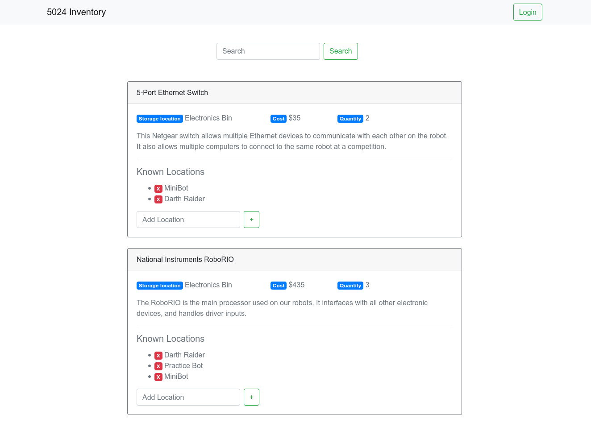
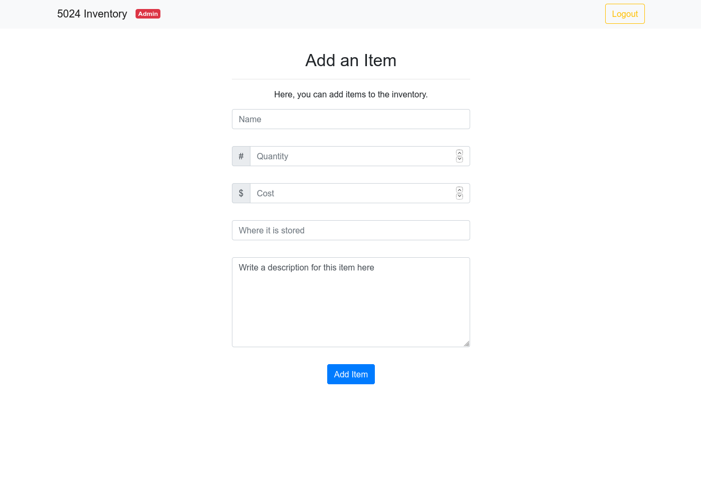

# Raider Robotics Parts Management
The 5024 Inventory Management System (IMS) is a small side-project designed by two team members to provide a simple tool for locating items in our team's shop.

## Features

 - Simple interface for team members
 - Login system for mentors and team leads to modify items, and add new inventory
 - Periodic backups
 - A simple database stored in a folder that can be deployed to any computer, or shared over FTP
 - Simple codebase

## Screenshots

### Home / Search screen


### Add item screen


## Using

To install, clone this repo, and run:
```
./gradlew build
```

To run, use:
```
./gradlew appRun
```

The application will be served locally at [localhost:8080/parts](http://localhost:8080/parts). If this is the first run, you must set up an admin account at [localhost:8080/parts/setup](http://localhost:8080/parts/setup).

The database is stored in your *home* or *User* directory.